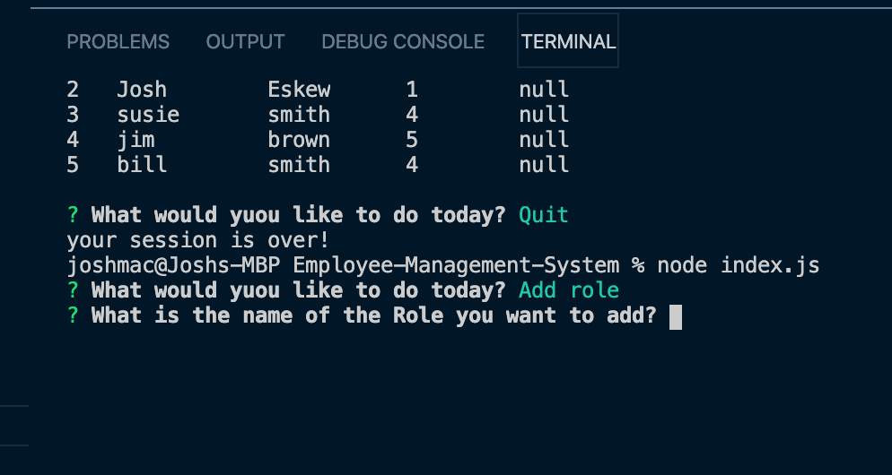
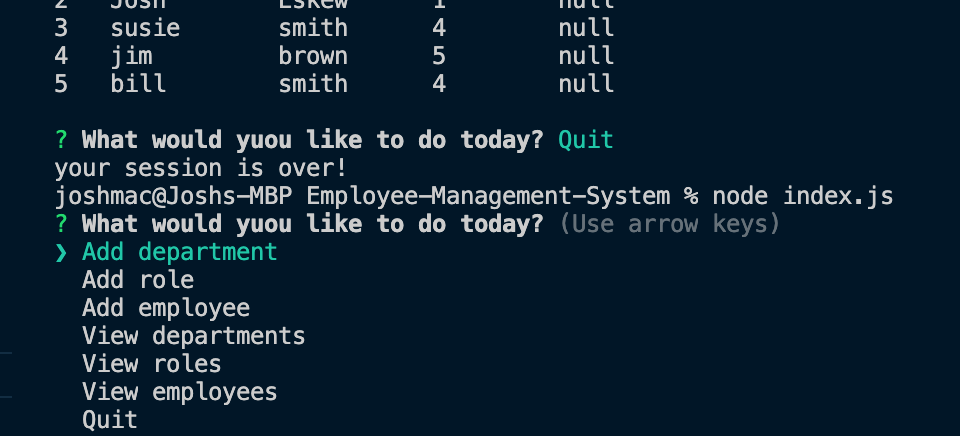

# Employee-Management-System

## Description

-This simple tool allows a buisness owner to add departments, roles and employees so that they can properly keep track of every aspect of their buisness. Once added, they can view all info on that particular field and also modify at their discretion.

## Who is this for:

-This is a wonderful tool for any buisness owner who needs to view and manage the department, roles, and employees in their company.

## Link

[Employee-Management-System]()

## Pictures

-Image of deployed site

-Recordings of app running

[Gif Recording](/Users/joshmac/Bootcamp/Employee-Management-System/assets/images/recording.gif)

